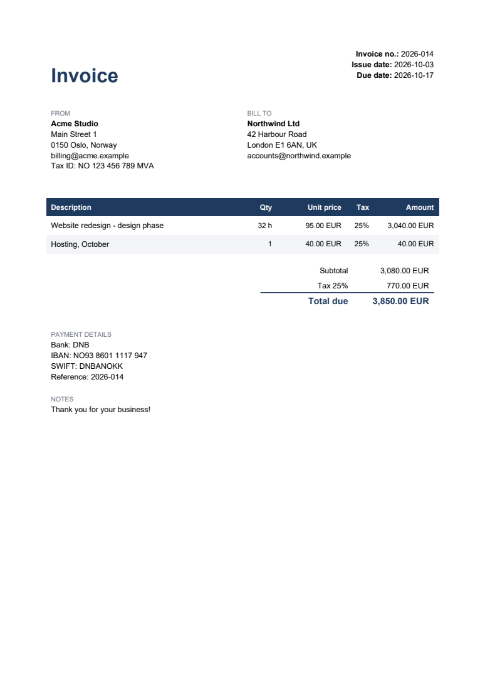

# Invoice Generator for Claude

A free invoice generator that lives in Claude. Describe the job in one sentence and get a professional PDF invoice with correct totals.

> create an invoice for Acme: 12 hours of design at 90 EUR, 25% VAT, due in 14 days



## Install

**Claude Code**
```
/plugin marketplace add Cavada76/invoice-generator
/plugin install invoice-generator@invoice-generator
```

**Claude.ai / Claude desktop:** download `invoice-generator-skill.zip` from Releases, then Settings → Capabilities → Skills → Upload.

## Features

- Any currency; US (`1,234.50`) or European (`1 234,50`) number format
- VAT / GST / MVA per line, several tax rates, discounts
- Due date from payment terms, bank/IBAN/SWIFT, payment reference or pay link
- Your logo, and labels in any language (e.g. Norwegian "Faktura")
- Remembers your business and bank details in `invoice-profile.json` and suggests the next invoice number

Requires Python with `reportlab` (Claude installs it if missing). Produces a clean commercial invoice; check your country's rules for mandatory VAT-invoice fields.

MIT licensed.
